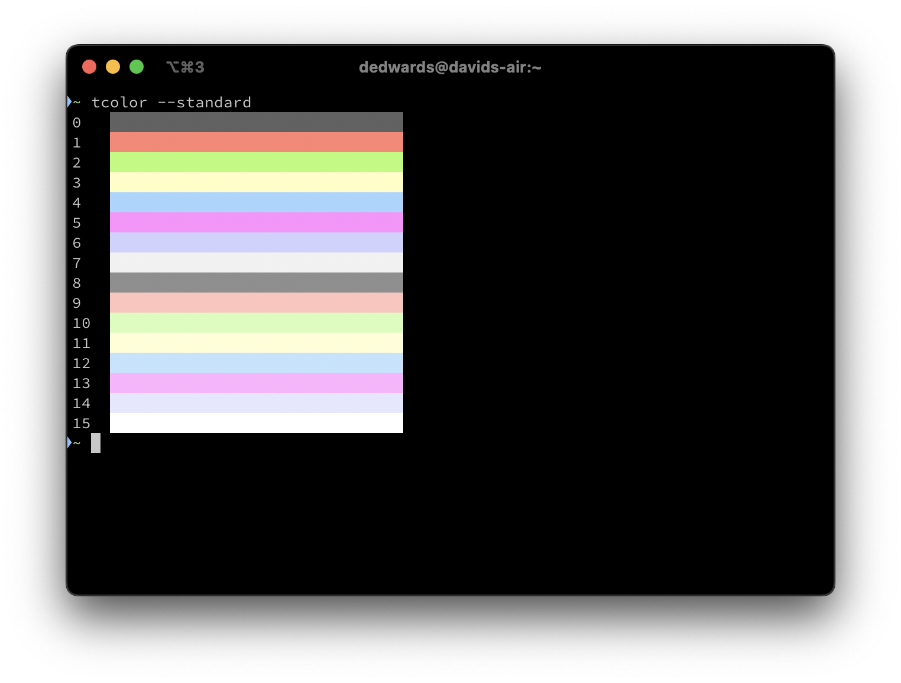
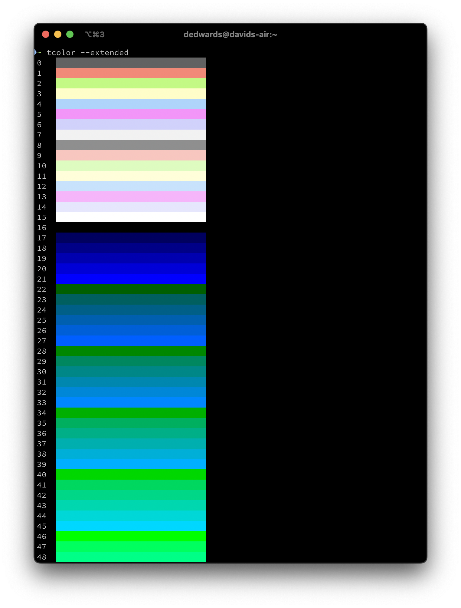
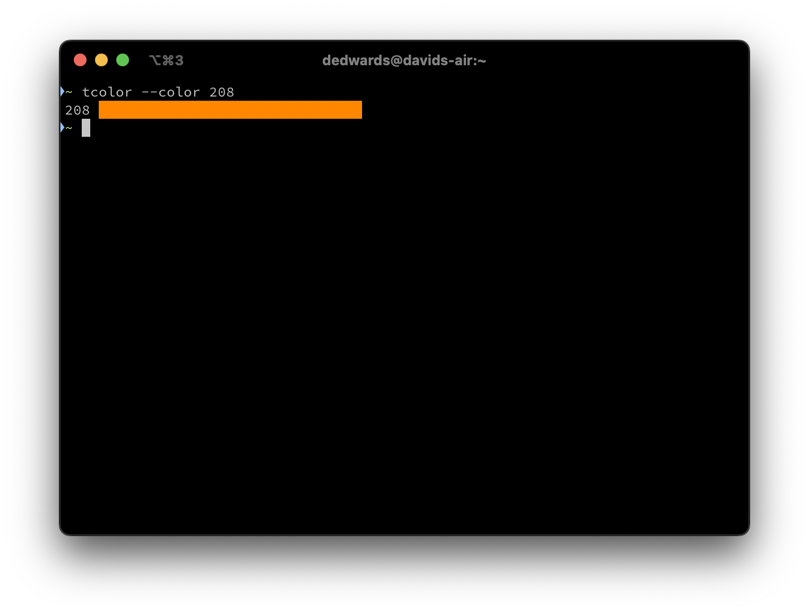
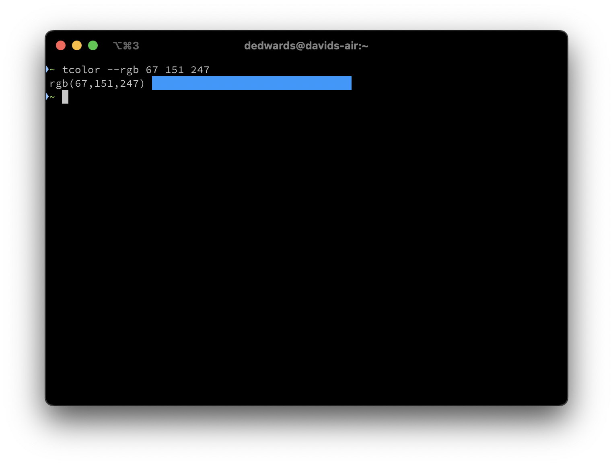

# tcolor

Displays ANSI colors on the terminal.

Show standard 4-bit colors.



Show extended 8-bit colors (partial output).



Show specific 8-bit color.



Show RGB color.



## Install

### Install from Homebrew

```shell
brew tap davidledwards/tcolor
brew install tcolor
```

### Install from GitHub

Releases can be downloaded directly from [GitHub](https://github.com/davidledwards/tcolor/releases).

Alternatively, using the [GitHub CLI](https://cli.github.com/), releases can also be downloaded from the command line. For example, to download version `0.1.0`, run the following command.

```shell
gh release download --repo https://github.com/davidledwards/tcolor v0.1.0
```

## Usage

`tcolor` is quite simple. Use `--help` to print a description of all available options.

## Build

Install [Rust](https://www.rust-lang.org/tools/install) if not done so already.

In the root directory of `tcolor`, run either of the folowing commands to build the project.

```shell
cargo build     # debug build
cargo build -r  # release build
```

Running the program can be done via `cargo` or directly using the target executable.

```shell
cargo run [-r] -- [options to tcolor go here]
```

```shell
target/debug/tcolor [options]
target/release/tcolor [options]
```

## Release

Releases containing binary artifacts are published on GitHub. The `release.sh` script automates the release process, which assumes that [GitHub CLI](https://cli.github.com/) has been installed.

The version of the release is derived from the package version in `Cargo.toml`. A new release on GitHub generates a corresponding tag, so the assumption is that the version number has been appropriately incremented. Otherwise, the release creation process will fail.

If the release process is successful, a new tag of the format `v<version>` is automatically created. For example, if the package version in `Cargo.toml` is `0.1.0`, then the corresponding tag is `v0.1.0`.

If the release process was problematic in any way, it can be deleted using the following command.

```shell
gh release delete --cleanup-tag --yes <tag>
```

## License

Copyright 2024 David Edwards

Licensed under the Apache License, Version 2.0 (the "License"); you may not use this file except in compliance with the License. You may obtain a copy of the License at

<http://www.apache.org/licenses/LICENSE-2.0>

Unless required by applicable law or agreed to in writing, software distributed under the License is distributed on an "AS IS" BASIS, WITHOUT WARRANTIES OR CONDITIONS OF ANY KIND, either express or implied. See the License for the specific language governing permissions and limitations under the License.
